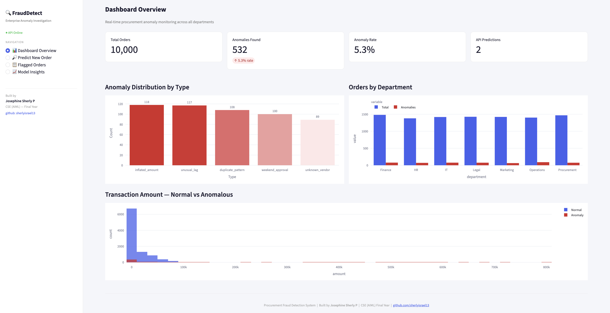
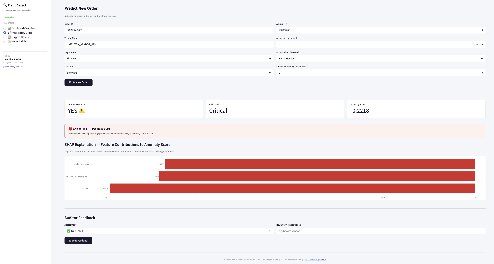
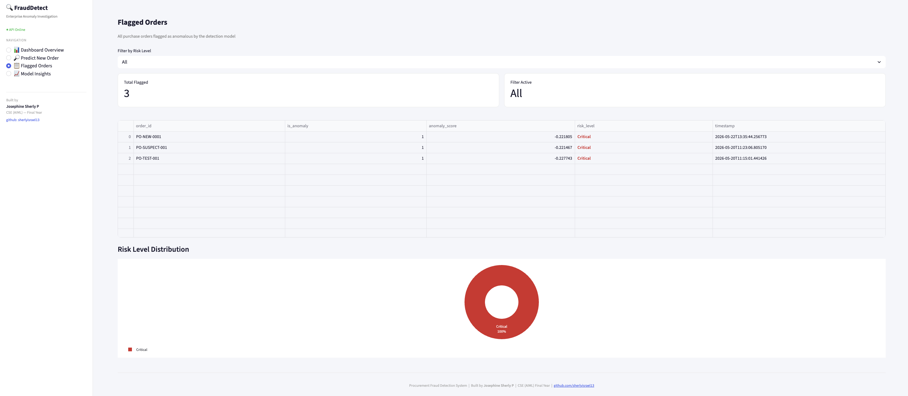
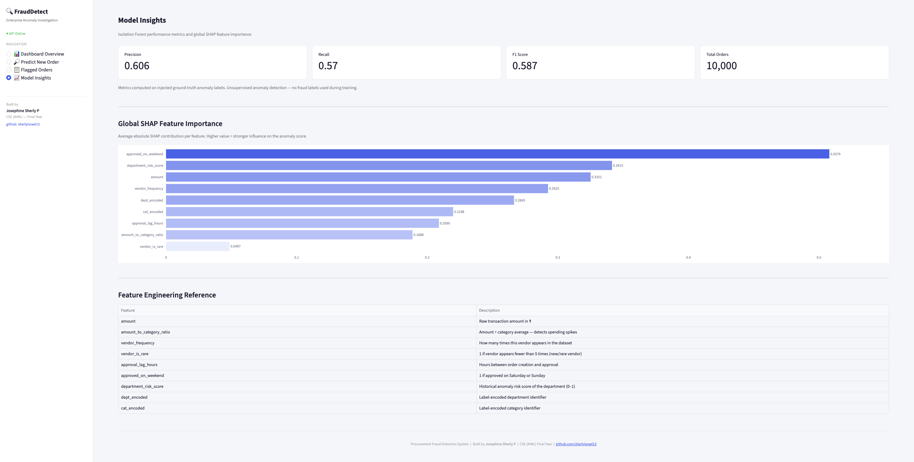

# Procurement Fraud Detection System with Explainable AI

> Enterprise anomaly investigation platform that assists auditors in identifying suspicious purchase orders using Isolation Forest, SHAP explainability, and a human-in-the-loop feedback workflow.

**Built by:** Josephine Sherly P | CSE (AIML) Final Year  
**GitHub:** [@sherlyisrael13](https://github.com/sherlyisrael13)

---

## Problem Statement

Large organizations process thousands of purchase orders monthly. Hidden within these are fraudulent transactions, duplicate payments, inflated invoices, and suspicious approval patterns. Many existing enterprise systems are expensive, difficult to customize, or lack transparent explainability for auditors. This project explores a lightweight, explainable alternative built entirely with open-source technologies.

---

## What This System Does

- Generates realistic synthetic enterprise procurement data with 5 injected anomaly types
- Detects anomalous purchase orders using unsupervised Isolation Forest — no fraud labels needed during training
- Assigns a **Risk Severity Level** (Low / Medium / High / Critical) to each flagged order
- Explains *why* each order was flagged using **SHAP feature contributions**
- Exposes all functionality via a **7-endpoint REST API** (FastAPI)
- Allows auditors to submit feedback (true fraud / false positive) via a **human-in-the-loop feedback endpoint**
- Visualizes everything in a **live 4-page Streamlit dashboard**

---

## System Architecture

Synthetic Data Generator
↓
Feature Engineering (9 features)
↓
Isolation Forest Model + SHAP Explainer
↓
Risk Scoring (Low / Medium / High / Critical)
↓
FastAPI Backend (7 endpoints)
↓
Streamlit Dashboard (4 pages)
↓
Human-in-the-Loop Feedback → Retraining Cycle

---

## Tech Stack

| Layer | Technology |
|---|---|
| Data generation | Python, Faker |
| ML model | Scikit-learn (Isolation Forest) |
| Explainability | SHAP (TreeExplainer) |
| Backend API | FastAPI, Uvicorn |
| Database | SQLite |
| Dashboard | Streamlit, Plotly |
| Language | Python 3.14 |

---

## Feature Engineering

| Feature | Description |
|---|---|
| `amount` | Raw transaction amount |
| `amount_to_category_ratio` | Amount ÷ category average — detects spending spikes |
| `vendor_frequency` | How many times this vendor appears in the dataset |
| `vendor_is_rare` | 1 if vendor appears fewer than 5 times |
| `approval_lag_hours` | Hours between order creation and approval |
| `approved_on_weekend` | 1 if approved on Saturday or Sunday |
| `department_risk_score` | Historical anomaly risk score of the department |
| `dept_encoded` | Label-encoded department |
| `cat_encoded` | Label-encoded category |

---

## Anomaly Types Injected

| Type | Description |
|---|---|
| `inflated_amount` | Amount 4–10× above category average |
| `unknown_vendor` | Vendor not seen in historical data |
| `weekend_approval` | Approved on Saturday or Sunday with very short lag |
| `duplicate_pattern` | Fixed suspicious amount with instant approval |
| `unusual_lag` | Approval took 200–720 hours |

---

## API Endpoints

| Method | Endpoint | Description |
|---|---|---|
| GET | `/` | Project info |
| GET | `/health` | API health check |
| GET | `/metrics` | Model performance + SHAP importance |
| POST | `/predict` | Submit order → get anomaly score + risk level + SHAP reasons |
| GET | `/anomalies` | List all flagged orders |
| POST | `/feedback` | Submit auditor feedback (true_fraud / false_positive) |
| POST | `/retrain` | Trigger retraining with accumulated feedback |

---

## Model Performance

| Metric | Value |
|---|---|
| Accuracy | 96% |
| Precision | 0.606 |
| Recall | 0.570 |
| F1 Score | 0.587 |
| Total Orders | 10,000 |
| Anomaly Rate | 5.3% |

> Metrics computed on injected ground-truth labels. Unsupervised detection — no fraud labels used during training.

---

## SHAP Interpretation

SHAP values show **feature contribution toward the anomaly score** — not fraud probability. This is an interpretability approximation that tells the auditor which features made a transaction look unusual. Larger absolute value = stronger influence on the flagging decision.

---

## How to Run Locally

**1. Clone the repository**
```bash
git clone https://github.com/sherlyisrael13/procurement-fraud-detection.git
cd procurement-fraud-detection
```

**2. Create virtual environment**
```bash
python3 -m venv venv
source venv/bin/activate
pip install -r requirements.txt
```

**3. Generate data**
```bash
python data/generate_data.py
```

**4. Train model**
```bash
python models/train_model.py
```

**5. Start API**
```bash
uvicorn api.main:app --reload
```

**6. Start Dashboard** (new terminal tab)
```bash
streamlit run dashboard/app.py
```

- API docs: http://127.0.0.1:8000/docs  
- Dashboard: http://localhost:8501

---
## Project Status

✅ Data generation  
✅ Feature engineering  
✅ Model training + SHAP explainability  
✅ Risk scoring  
✅ FastAPI backend  
✅ Streamlit dashboard  
✅ Human-in-the-loop feedback  

## Screenshots

### Dashboard Overview


### Predict New Order — Critical Risk Detection


### Flagged Orders


### Model Insights — SHAP Feature Importance


---

*Built by Josephine Sherly P | CSE (AIML) Final Year | Batch 2027*  
*GitHub: [@sherlyisrael13](https://github.com/sherlyisrael13)*
